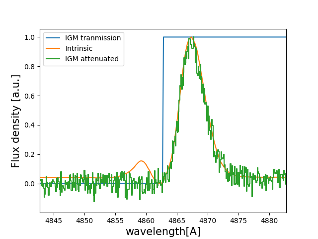
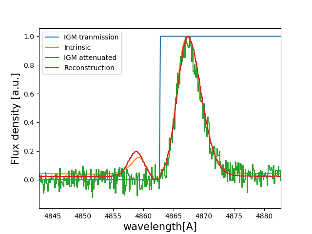
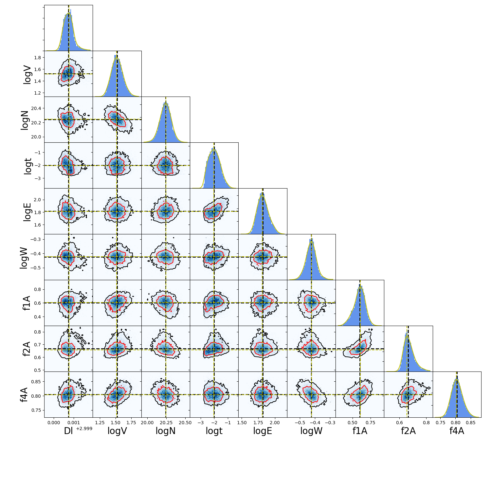

Tutorial : Fitting a IGM/CGM attenuated line profile using deep learning
=====================================================

In this tutorial you will, hopefully, learn how fit Lyman-alpha line profiles using deep learning with `zELDA`. 

Getting started
***************

Let's start by loading `zELDA` creating a mock line profile that we will fit later. For more details on how to create a mock line profile go to :doc:`Mock line profiles <Tutorial_mock>`

.. code:: python

          >>> import Lya_zelda_II as Lya
          >>> import numpy as np

          >>> your_grids_location = '/This/Folder/Contains/The/Grids/'
          >>> Lya.funcs.Data_location = your_grids_location

          >>> Geometry = 'Thin_Shell_Cont'
          >>> LyaRT_Grid = Lya.load_Grid_Line( Geometry )

          >>> # Defining the model parameters:
          >>> z_t      = 3.0   # redshift of the source
          >>> V_t      = 50.0  # Outflow expansion velocity [km/s]
          >>> log_N_t  = 20.   # Logarithmic of the neutral hydrogen column density [cm**-2]
          >>> t_t      = 0.01  # Dust optical depth
          >>> log_EW_t = 1.5   # Logarithmic the intrinsic equivalent width [A]
          >>> W_t      = 0.5   # Intrinsic width of the line [A]
          >>> F_t      = 1.    # Total flux of the line

          >>> # Defining the quality of the line profile:
          >>> PNR_t  = 20.0 # Signal to noise ratio of the maximum of the line.
          >>> FWHM_t = 0.1  # Full width half maximum diluting the line. Mimics finite resolution. [A]
          >>> PIX_t  = 0.1  # Wavelength binning of the line. [A]

          >>> np.random.seed(5) # Set a numpy random seed.

where `/This/Folder/Contains/The/Grids/` is the place where you store the LyaRT data grids, as shown in the installation section. 

Now let's create an IGM transmission curve. For this example we are going to set the IGM transmission bluer than Lyman-alpha to 0 and for redder than Lyman-alpha to 1.

.. code:: python

          >>> w_Lya = 1215.68
          >>> w_IGM_rest_Arr = np.linspace( w_Lya-20.0 , w_Lya+20.0 , 1000 )
          >>> T_IGM_Arr = np.ones( len( w_IGM_rest_Arr ) )
          
          >>> T_IGM_Arr[ w_IGM_rest_Arr < w_Lya ] = 0

Now let's generate the observed Lyman-alpha line profile:

.. code:: python

          >>> w_IGM_Arr , f_IGM_Arr , s_IGM_Arr , info = Lya.Generate_a_real_line( z_t , V_t, log_N_t, t_t, F_t, log_EW_t, W_t , PNR_t, FWHM_t , PIX_t , LyaRT_Grid, Geometry ,  T_IGM_Arr=T_IGM_Arr , w_IGM_Arr=w_IGM_rest_Arr , RETURN_ALL=True )

`w_IGM_Arr` is a numpy array that contains the wavelength where the line profile is evaluated. Meanwhile, `f_IGM_Arr` is the actual line profile. `s_IGM_Arr` is the uncertainty of the flux density. `info` is a python dictinary that contains a lot of information about how the line was computed, like the ideal line profile, the true IGM escape fraction, etc. Remeber that if you want to use the line profile grid with lower RAM memory occupation you must pass `MODE='LIGHT'` to `Lya.load_Grid_Line`.

We can obtain the intrinsic line profile with ideal conditions as...

.. code:: python

          >>> w_INT_Arr = info[ 'w_obs' ] # wavelength array of the intrinsic line
          >>> f_INT_Arr = info[ 'Intrinsic' ] # flux array of the intrinsic line

The true IGM escape fraction is...

.. code:: python

          >>> print( info['f_IGM_4.0'] )
          >>> 0.8827655503368276

Let's rescale the lines so that they have a comparable amplitude:

.. code:: python

          >>> s_IGM_Arr = s_IGM_Arr * 1. / np.amax( f_IGM_Arr )
          >>> f_IGM_Arr = f_IGM_Arr * 1. / np.amax( f_IGM_Arr )
          >>> f_INT_Arr = f_INT_Arr * 1. / np.amax( f_INT_Arr )

Let's have a look to how the line looks:

.. code:: python

          >>> w_IGM_pix_Arr  , f_IGM_pix_Arr  = Lya.plot_a_rebinned_line( w_IGM_Arr , f_IGM_Arr , PIX_t )

          >>> import pylab as plt
          >>> plt.plot( w_IGM_rest_Arr*(1+z_t) , T_IGM_Arr , label='IGM tranmission' )
          >>> plt.plot( w_INT_Arr , f_INT_Arr , label='Intrinsic' )
          >>> plt.plot( w_IGM_pix_Arr , f_IGM_pix_Arr , label='IGM attenuated' )
          >>> plt.legend(loc=0)
          >>> plt.xlabel('wavelength[A]' , size=15 )
          >>> plt.ylabel('Flux density [a.u.]' , size=15 )
          >>> plt.xlim( ( w_Lya - 5 ) * (1+z_t) , ( w_Lya + 5 ) * (1+z_t) )
          >>> plt.show()

Fitting a line
***************

Now that we have our mock line profile, let's fit it. In this example we are going to use `MODE='IGM-z'`. There are three possible modes: `MODE='IGM+z'` , `MODE='IGM-z'` and `MODE='NoIGM'` . Each of these `MODE` use a differente NN with a different training set. `MODE='IGM+z'` is trained so that the IGM transmission curves in the training set match the real IGM evolution with redshift. `MODE='IGM-z'` uses an IGM that is constant with redshift, and therefore it is more unbiased to redshift dependence than `MODE='IGM+z'`. Note that `MODE='IGM+z'` should be baised towards reallity. Then, `MODE='NoIGM'` was trained wihtout the IGM absorption, only the ISM part. 

.. code:: python

          >>> N_ITER = 10000 # Number of times to pertube the line profile

          >>> RESULTS = Lya.Fit_Observed_line_with_IGM( w_IGM_Arr , f_IGM_Arr , s_IGM_Arr , PIX_t , FWHM_t , MODE='IGM-z' , N_ITER=N_ITER ) 

The function `Fit_Observed_line_with_IGM` is used to fit 1 line and it loads the NN and PCA models every time that it is called. This is not a problem if only a handful of lines are fitted at the same time. However, if the user wants to fit many lines, it could be better to load the NN and PCA models outside the function and pass it as an agument. This is done as...

.. code:: python

          >>> DIC_loaded_models , my_PCA_model = Lya.Pipieline_Zelda_2_Load_Models( 'IGM-z' )

          >>> RESULTS = Lya.Fit_Observed_line_with_IGM( w_IGM_Arr , f_IGM_Arr , s_IGM_Arr , PIX_t , FWHM_t , MODE='IGM-z' , N_ITER=N_ITER , DIC_loaded_models=DIC_loaded_models , my_PCA_model=my_PCA_model )

`RESULTS` is a python dictionaty that stores all the information of the fit. The percentile 50 is stores as... `x_Q50`, the perntile 16 as `x_Q16`, etc, where `x` is a fitted varible, like redshift, etc. Therefore, the fitted outflow values are

.. code:: python

          >>> z_sol     = RESULTS[    'z_Q50' ] #redshift
          >>> log_V_sol = RESULTS[ 'logV_Q50' ] # logarith of expansion velocity.
          >>> log_N_sol = RESULTS[ 'logN_Q50' ] # logarith of neutral hydrogen column density.
          >>> log_t_sol = RESULTS[ 'logt_Q50' ] # logarith of dust optical depth.
          >>> log_E_sol = RESULTS[ 'logE_Q50' ] # logarith of intrinsic equivalent width.
          >>> log_W_sol = RESULTS[ 'logW_Q50' ] # logarith of intrinsic width.
          >>> f_ig1_sol = RESULTS[  'f1A_Q50' ] # IGM Lya escape fraction 1A arround Lya.
          >>> f_ig2_sol = RESULTS[  'f2A_Q50' ] # IGM Lya escape fraction 2A arround Lya.
          >>> f_ig4_sol = RESULTS[  'f4A_Q50' ] # IGM Lya escape fraction 4A arround Lya.

Then, the measured IGM Lya escape fraction 4A arround Lya. is...

.. code:: python

          >>> print( RESULTS['f4A_Q50'] , '+-' , RESULTS['f4A_Q84']-RESULTS['f4A_Q16'] )
          >>> 0.8047662675380707 +- [0.06671568]

Showing a fitted line profile
***************

We can compute the solution line profile as...

.. code:: python

          >>> w_SOL_OBSERVED_Arr , f_SOL_OBSERVED_Arr , s_SOL_OBSERVED_Arr , sol_info = Lya.Generate_a_real_line( z_sol , 10**log_V_sol , log_N_sol, 10**log_t_sol, F_t, log_E_sol, 10**log_W_sol , 1000. , FWHM_t , PIX_t , LyaRT_Grid, Geometry , RETURN_ALL=True )

And we can plot it to compare with the actual intrinsic line profile:

.. code:: python

          >>> f_SOL_OBSERVED_Arr = f_SOL_OBSERVED_Arr * 1. / np.amax(f_SOL_OBSERVED_Arr) # rescaling to be comparable

          >>> w_SOL_OBSERVED_pix_Arr  , f_SOL_OBSERVED_pix_Arr  = Lya.plot_a_rebinned_line( w_SOL_OBSERVED_Arr , f_SOL_OBSERVED_Arr , PIX_t )

          >>> plt.plot( w_IGM_rest_Arr*(1+z_t) , T_IGM_Arr , label='IGM tranmission' )
          >>> plt.plot( w_INT_Arr , f_INT_Arr , label='Intrinsic' )
          >>> plt.plot( w_IGM_pix_Arr , f_IGM_pix_Arr , label='IGM attenuated' )
          >>> plt.plot( w_SOL_OBSERVED_pix_Arr , f_SOL_OBSERVED_pix_Arr , label='Reconstruction' )
          >>> plt.legend(loc=0)
          >>> plt.xlabel('wavelength[A]' , size=15 )
          >>> plt.ylabel('Flux density [a.u.]' , size=15 )
          >>> plt.xlim( ( w_Lya - 5 ) * (1+z_t) , ( w_Lya + 5 ) * (1+z_t) )
          >>> plt.show()

You should get something like:

Showing the Monte Carlo iterations.
***************

`RESULTS` also contains all the chain information for each of the noise perturbations in `RESULTS['All']`. Let's plot the chains. For that we will use the functions...

.. code:: python

          def get_extremes_of_a_prop( prop_Arr ):
          
              Q_top = 99.9
              Q_low = 0.1
          
              y_prop_min = np.percentile( prop_Arr , Q_low )
              y_prop_50  = np.percentile( prop_Arr , 50 )
              y_prop_max = np.percentile( prop_Arr , Q_top  )
          
              mask_y = ( prop_Arr > y_prop_min ) * ( prop_Arr < y_prop_max )
          
              y_min = y_prop_50 - 4.*np.std( prop_Arr[ mask_y ] )
              y_max = y_prop_50 + 4.*np.std( prop_Arr[ mask_y ] )
          
              return y_min , y_max

          def make_corner_plots( my_chains_matrix ):
          
              import numpy as np
              import pylab as plt
              from scipy.ndimage import gaussian_filter1d
          
              N_dim = len( machine_names )
              N_pix_smooth = 2
              NNN_bins = 50
          
              ax_list = []
          
              label_list = machine_names
          
              MAIN_VALUE_mean   = np.zeros(N_dim)
              MAIN_VALUE_median = np.zeros(N_dim)
              MAIN_VALUE_MAX    = np.zeros(N_dim)
              SMOO_VALUE_MAX    = np.zeros(N_dim)
          
              for i in range( 0 , N_dim ):
          
                  x_prop = my_chains_matrix[ : , i ]
          
                  x_prop_min , x_prop_max = get_extremes_of_a_prop( x_prop )
                  x_min = x_prop_min
                  x_max = x_prop_max
          
                  mamamask = ( x_prop > x_min ) * ( x_prop < x_max )
          
                  MAIN_VALUE_mean[  i] = np.mean(       x_prop[ mamamask ] )
                  MAIN_VALUE_median[i] = np.percentile( x_prop[ mamamask ] , 50 )
          
                  HH , edges_HH = np.histogram( x_prop[ mamamask ] , NNN_bins , range=[ x_prop_min , x_prop_max ] )
          
                  new_H_Arr = gaussian_filter1d( HH , N_pix_smooth )
          
                  center_Arrr = 0.5 * ( edges_HH[1:] + edges_HH[:-1] )
          
                  MAX_prop_smooth = center_Arrr[ new_H_Arr == np.amax(new_H_Arr) ][0]
          
                  SMOO_VALUE_MAX[i] = MAX_prop_smooth
          
              plt.figure( figsize=(15,15) )
          
              Q_top = 99.9
              Q_low = 0.1
          
              for i in range( 0 , N_dim ):
          
                  y_prop = my_chains_matrix[ : , i ]
          
                  y_min , y_max = get_extremes_of_a_prop( y_prop )
          
                  for j in range( 0 , N_dim ):
          
                      if i < j : continue
          
                      x_prop = my_chains_matrix[ : , j ]
          
                      x_min , x_max = get_extremes_of_a_prop( x_prop )
          
                      ax = plt.subplot2grid( ( N_dim , N_dim ) , (i, j)  )
          
                      ax_list += [ ax ]
          
                      DDX = x_max - x_min
                      DDY = y_max - y_min
          
                      if i==j :
          
                          H , edges = np.histogram( x_prop , NNN_bins , range=[x_min,x_max] )
          
                          ax.hist( x_prop , NNN_bins , range=[x_min,x_max] , color='cornflowerblue' )
          
                          ax.plot( [ MAIN_VALUE_median[i] , MAIN_VALUE_median[i] ] , [ 0.0 , 1e10 ] , 'k--' , lw=2 )
          
                          ax.set_ylim( 0 , 1.1 * np.amax(H) )
          
                          center_Arrr = 0.5 * ( edges[1:] + edges[:-1] )
          
                          new_H_Arr = gaussian_filter1d( H , N_pix_smooth )
          
                          center_Arrr = 0.5 * ( edges[1:] + edges[:-1] )
          
                          ax.plot( center_Arrr , new_H_Arr , color='y' )
          
                          ax.plot( [ SMOO_VALUE_MAX[i] , SMOO_VALUE_MAX[i] ] , [ 0.0 , 1e10 ] , 'y--' )
          
          
                      else :
          
                          XX_min = x_min - DDX * 0.2
                          XX_max = x_max + DDX * 0.2
          
                          YY_min = y_min - DDY * 0.2
                          YY_max = y_max + DDY * 0.2
          
                          H , edges_y , edges_x = np.histogram2d( x_prop , y_prop , NNN_bins , range=[[XX_min , XX_max],[YY_min , YY_max]] )
          
                          y_centers = 0.5 * ( edges_y[1:] + edges_y[:-1] )
                          x_centers = 0.5 * ( edges_x[1:] + edges_x[:-1] )
          
                          H_min = np.amin( H )
                          H_max = np.amax( H )
          
                          N_bins = 10000
          
                          H_Arr = np.linspace( H_min , H_max , N_bins )[::-1]
          
                          fact_up_Arr = np.zeros( N_bins )
          
                          TOTAL_H = np.sum( H )
          
                          for iii in range( 0 , N_bins ):
          
                              mask = H > H_Arr[iii]
          
                              fact_up_Arr[iii] = np.sum( H[ mask ] ) / TOTAL_H
          
                          H_value_68 = np.interp( 0.680 , fact_up_Arr , H_Arr )
                          H_value_95 = np.interp( 0.950 , fact_up_Arr , H_Arr )
          
                          ax.pcolormesh( edges_y , edges_x , H.T , cmap='Blues' )
          
                          ax.contour( y_centers, x_centers , H.T , colors='k' , levels=[ H_value_95 ] )
                          ax.contour( y_centers, x_centers , H.T , colors='r' , levels=[ H_value_68 ] )
          
                          X_VALUE =  MAIN_VALUE_median[j]
                          Y_VALUE =  MAIN_VALUE_median[i]
          
                          ax.plot( [ X_VALUE , X_VALUE ] , [    -100 ,     100 ] , 'k--' , lw=2 )
                          ax.plot( [    -100 ,     100 ] , [ Y_VALUE , Y_VALUE ] , 'k--' , lw=2 )
          
                          ax.plot( [ SMOO_VALUE_MAX[j] , SMOO_VALUE_MAX[j] ] , [              -100 ,               100 ] , 'y--' )
                          ax.plot( [              -100 ,               100 ] , [ SMOO_VALUE_MAX[i] , SMOO_VALUE_MAX[i] ] , 'y--' )
          
                          ax.set_ylim( y_min-0.05*DDY , y_max+0.05*DDY )
          
                      ax.set_xlim( x_min-0.05*DDX , x_max+0.05*DDX )
          
                      if i==N_dim-1:
                          ax.set_xlabel( label_list[j] , size=20 )
          
                      if j==0 and i!=0 :
                          ax.set_ylabel( label_list[i] , size=20 )
          
                      if j!=0:
                          plt.setp( ax.get_yticklabels(), visible=False)
          
                      if j==0 and i==0:
                          plt.setp( ax.get_yticklabels(), visible=False)
          
                      if i!=len( label_list)-1 :
                          plt.setp( ax.get_xticklabels(), visible=False)
          
              plt.subplots_adjust( left = 0.09 , bottom = 0.15 , right = 0.98 , top = 0.99 , wspace=0., hspace=0.)
          
              return SMOO_VALUE_MAX
          #%%%%%%%%%%%%%%%%%%%%%%%%%%%%%%%%%%%%%%%%%%%%%%%%%%%%%%%%%%%%%%%%%%%%%%#
          #%%%%%%%%%%%%%%%%%%%%%%%%%%%%%%%%%%%%%%%%%%%%%%%%%%%%%%%%%%%%%%%%%%%%%%#

And we run it like...

.. code:: python

          >>> machine_names = [ 'Dl' , 'logV' , 'logN' ,'logt' ,'logE' ,'logW' ,'f1A' ,'f2A' , 'f4A' ]
          
          >>> CHAINS = np.zeros( len( RESULTS['All']['Dl'] ) * len(machine_names) ).reshape( len( RESULTS['All']['Dl'] ) , len(machine_names) )
          
          >>> for jj , prop_name in enumerate( machine_names ) :
          
          >>>     CHAINS[ : , jj ] = RESULTS['All'][ prop_name ]
          
          >>> SMOO_VALUE_MAX = make_corner_plots( CHAINS )
          
          >>> plt.savefig( 'fig_tutorial_fit_IGM_3.png' )
          >>> plt.clf()

You should get something line this...

