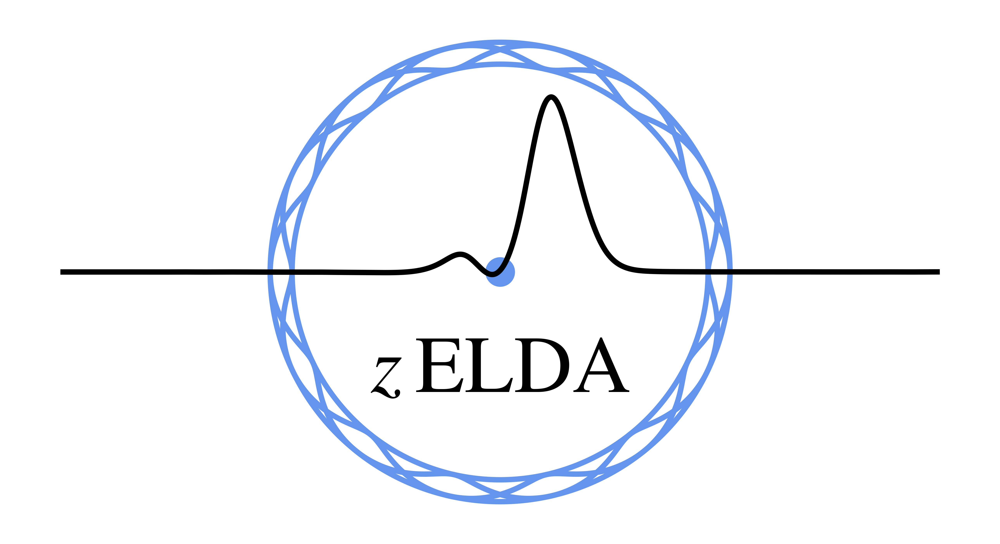

.. zELDA documentation master file, created by
   sphinx-quickstart on Tue May  4 11:21:54 2021.
   You can adapt this file completely to your liking, but it should at least
   contain the root `toctree` directive.

zELDA's documentation v0.0
=====================

.. toctree::
   :maxdepth: 2
   :caption: Contents zELDA II:

   intro
   installation
   About_the_data_grids
   Tutorial_ideal
   Tutorial_mock
   Tutorial_MCMC
   Tutorial_fesc
   funcs

.. toctree::
   :maxdepth: 2
   :caption: Contents zELDA I:

   Tutorial_Train
   Tutorial_DNN

Indices and tables
==================

* :ref:`genindex`
